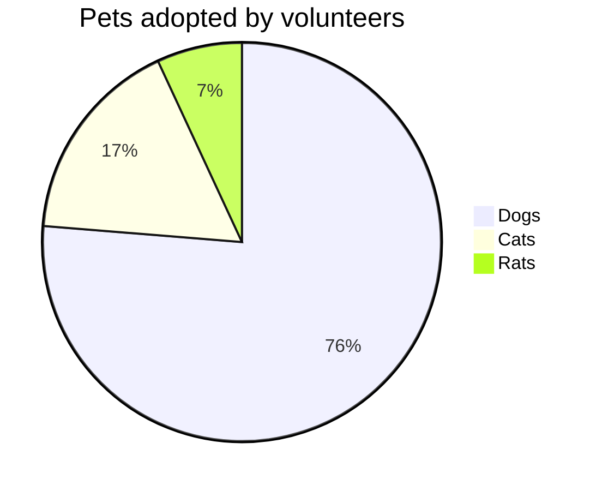

# PlantUML Graphs

### 1. Table Usage

**For now, these extended features are provided:**

- Cells spanning multiple columns
- Cells spanning multiple rows
- Cells text align separately
- Table header not required
- Grouped table header rows or data rows

Noted that GitHub filters out style property, so the example displays with the obsolete align property. But in actual this plugin outputs style property with text-align CSS attribute.

#### Rowspan and Colspan

^^ in a cell indicates it should be merged with the cell above.  
This feature is contributed by [pmccloghrylaing](https://github.com/pmccloghrylaing).

<hr> 

|              Stage | Direct Products | ATP Yields |
| -----------------: | --------------: | ---------: |
|         Glycolysis |          2 ATP              ||
| ^^                 |          2 NADH |   3--5 ATP |
| Pyruvaye oxidation |          2 NADH |      5 ATP |
|  Citric acid cycle |          2 ATP              ||
| ^^                 |          6 NADH |     15 ATP |
| ^^                 |          2 FADH |      3 ATP |
|                               30--32 ATP        |||

<hr>

```markdown
from md:
|              Stage | Direct Products | ATP Yields |
| -----------------: | --------------: | ---------: |
|         Glycolysis |          2 ATP              ||
| ^^                 |          2 NADH |   3--5 ATP |
| Pyruvaye oxidation |          2 NADH |      5 ATP |
|  Citric acid cycle |          2 ATP              ||
| ^^                 |          6 NADH |     15 ATP |
| ^^                 |          2 FADH |      3 ATP |
|                               30--32 ATP        |||
```


#### Multiline

A backslash at end to join cell contents with the following lines.  
This feature is contributed by [Lucas-C](https://github.com/Lucas-C).

<hr>

| :    Easy Multiline   : |||
| :----- | :----- | :------ |
| Apple  | Banana | Orange  \
| Apple  | Banana | Orange  \
| Apple  | Banana | Orange
| Apple  | Banana | Orange  \
| Apple  | Banana | Orange  |
| Apple  | Banana | Orange  |

<hr>

```markdown
from md:
| :    Easy Multiline   : |||
| :----- | :----- | :------ |
| Apple  | Banana | Orange  \
| Apple  | Banana | Orange  \
| Apple  | Banana | Orange
| Apple  | Banana | Orange  \
| Apple  | Banana | Orange  |
| Apple  | Banana | Orange  |
```

#### Headerless

Table header can be eliminated.

<hr>

|--|--|--|--|--|--|--|--|
|♜| |♝|♛|♚|♝|♞|♜|
| |♟|♟|♟| |♟|♟|♟|
|♟| |♞| | | | | |
| |♗| | |♟| | | |
| | | | |♙| | | |
| | | | | |♘| | |
|♙|♙|♙|♙| |♙|♙|♙|
|♖|♘|♗|♕|♔| | |♖|

<hr>

```markdown
from md:
|--|--|--|--|--|--|--|--|
|♜| |♝|♛|♚|♝|♞|♜|
| |♟|♟|♟| |♟|♟|♟|
|♟| |♞| | | | | |
| |♗| | |♟| | | |
| | | | |♙| | | |
| | | | | |♘| | |
|♙|♙|♙|♙| |♙|♙|♙|
|♖|♘|♗|♕|♔| | |♖|
```

#### Cell Alignment

Markdown table syntax use colons ":" for forcing column alignment.  
Therefore, here we also use it for forcing cell alignment.

Table cell can be set alignment separately.

<hr>

| :        Fruits \|\| Food       : |||
| :--------- | :-------- | :--------  |
| Apple      | : Apple : | Apple      \
| Banana     |   Banana  | Banana     \
| Orange     |   Orange  | Orange     |
| :   Rowspan is 4    : || How's it?  |
|^^    A. Peach         ||   1. Fine :|
|^^    B. Orange        ||^^ 2. Bad   |
|^^    C. Banana        ||  It's OK!  |

<hr>

```markdown
from md:
| :        Fruits \|\| Food       : |||
| :--------- | :-------- | :--------  |
| Apple      | : Apple : | Apple      \
| Banana     |   Banana  | Banana     \
| Orange     |   Orange  | Orange     |
| :   Rowspan is 4    : || How's it?  |
|^^    A. Peach         ||   1. Fine :|
|^^    B. Orange        ||^^ 2. Bad   |
|^^    C. Banana        ||  It's OK!  |
```

#### Cell Markdown

Sometimes we may need some abundant content (e.g., mathjax, image, video) in Markdown table  
Therefore, here we also make markown syntax possible inside a cell.

<hr>

| :                   MathJax \|\| Image                 : |||
| :------------ | :-------- | :----------------------------- |
| Apple         | : Apple : | Apple                          \
| Banana        | Banana    | Banana                         \
| Orange        | Orange    | Orange                         |
| :     Rowspan is 4     : || :        How's it?           : |
| ^^     A. Peach          ||    1. ![example][cell-image]   |
| ^^     B. Orange         || ^^ 2. $I = \int \rho R^{2} dV$ |
| ^^     C. Banana         || **It's OK!**                   |

[cell-image]: https://jekyllrb.com/img/octojekyll.png "An exemplary image"

<hr>

```markdown
from md:
| :                   MathJax \|\| Image                 : |||
| :------------ | :-------- | :----------------------------- |
| Apple         | : Apple : | Apple                          \
| Banana        | Banana    | Banana                         \
| Orange        | Orange    | Orange                         |
| :     Rowspan is 4     : || :        How's it?           : |
| ^^     A. Peach          ||    1. ![example][cell-image]   |
| ^^     B. Orange         || ^^ 2. $I = \int \rho R^{2} dV$ |
| ^^     C. Banana         || **It's OK!**                   |

[cell-image]: https://jekyllrb.com/img/octojekyll.png "An exemplary image"
```

#### Cell Inline Attributes

This feature is very useful for custom cell such as using inline style. (e.g., background, color, font)  
The idea and syntax comes from the [Maruku](http://maruku.rubyforge.org/) package.  

[](https://kramdown.gettalong.org/syntax.html#block-ials)

Following are some examples of attributes definitions (ALDs) and afterwards comes the syntax explanation:

<hr>

{:ref-name: #id .cls1 .cls2}
{:second: ref-name #id-of-other title="hallo you"}
{:other: ref-name second}

<hr>

```markdown
from md:
{:ref-name: #id .cls1 .cls2}
{:second: ref-name #id-of-other title="hallo you"}
{:other: ref-name second}
```

An ALD line has the following structure:

- a left brace, optionally preceded by up to three spaces,
- followed by a colon, the id and another colon,
- followed by attribute definitions (allowed characters are backslash-escaped closing braces or any character except a not escaped closing brace),
- followed by a closing brace and optional spaces until the end of the line.

If there is more than one ALD with the same reference name, the attribute definitions of all the ALDs are processed like they are defined in one ALD.

An inline attribute list (IAL) is used to attach attributes to another element.  
Here are some examples for span IALs:

<hr>

{: #id .cls1 .cls2} <!-- #id <=> id="id", .cls1 .cls2 <=> class="cls1 cls2" -->
{: ref-name title="hallo you"}
{: ref-name class='.cls3' .cls4}

<hr>

```markdown
from md:
{: #id .cls1 .cls2} <!-- #id <=> id="id", .cls1 .cls2 <=> class="cls1 cls2" -->
{: ref-name title="hallo you"}
{: ref-name class='.cls3' .cls4}
```

Here is an example for custom table cell with IAL:

<hr>

{:color-style: style="background: black;"}
{:color-style: style="color: white;"}
{:text-style: style="font-weight: 800; text-decoration: underline;"}

|:             Here's an Inline Attribute Lists example                :||||
| ------- | ------------------ | -------------------- | ------------------ |
|:       :|:  <div style="color: red;"> &lt; Normal HTML Block > </div> :|||
| ^^      |   Red    {: .cls style="background: orange" }                |||
| ^^ IALs |   Green  {: #id style="background: green; color: white" }    |||
| ^^      |   Blue   {: style="background: blue; color: white" }         |||
| ^^      |   Black  {: color-style text-style }                         |||

<hr>

```markdown
from md:
{:color-style: style="background: black;"}
{:color-style: style="color: white;"}
{:text-style: style="font-weight: 800; text-decoration: underline;"}

|:             Here's an Inline Attribute Lists example                :||||
| ------- | ------------------ | -------------------- | ------------------ |
|:       :|:  <div style="color: red;"> &lt; Normal HTML Block > </div> :|||
| ^^      |   Red    {: .cls style="background: orange" }                |||
| ^^ IALs |   Green  {: #id style="background: green; color: white" }    |||
| ^^      |   Blue   {: style="background: blue; color: white" }         |||
| ^^      |   Black  {: color-style text-style }                         |||
```

Additionally, [here](https://kramdown.gettalong.org/syntax.html#block-ials) you can learn more details about IALs.

### 2. MathJax Usage

[MathJax](http://www.mathjax.org/) is an open-source JavaScript display engine for LaTeX, MathML, and AsciiMath notation that works in all modern browsers.

Some of the main features of MathJax include:

- High-quality display of LaTeX, MathML, and AsciiMath notation in HTML pages
- Supported in most browsers with no plug-ins, extra fonts, or special
  setup for the reader
- Easy for authors, flexible for publishers, extensible for developers
- Supports math accessibility, cut-and-paste interoperability, and other
  advanced functionality
- Powerful API for integration with other web applications

#### 2.1 Performance optimization

At building stage, the MathJax engine script will be added by automatically checking whether there is a math expression in the page, this feature can help you improve the page performance  on loading speed.

#### 2.2 How to use?

Put your math expression within \$...\$

<hr>

$ a * b = c ^ b $

```markdown
from md:
$ a * b = c ^ b $
```

$ 2^{\frac{n-1}{3}} $

```markdown
from md:
$ 2^{\frac{n-1}{3}} $
```

$ \int\_a^b f(x)\,dx. $

```markdown
from md:
$ \int\_a^b f(x)\,dx. $
```

### 3. PlantUML Usage

[PlantUML](https://plantuml.com) is a component that allows to quickly write:

- sequence diagram,
- use case diagram,
- class diagram,
- activity diagram,
- component diagram,
- state diagram,
- object diagram

There are two ways to create a diagram in your Jekyll blog page:

<hr>

@startuml
Bob -> Alice : hello
@enduml

<hr>

````
from md:
```plantuml!
Bob -> Alice : hello world
```
````

or

```markdown
from md:
@startuml
Bob -> Alice : hello
@enduml
```

A more complex activity diagram:

<hr>

@startuml
start
repeat
  :Test something;
    if (Something went wrong?) then (no)
      #palegreen:OK;
      break
    endif
    ->NOK;
    :Alert "Error with long text";
repeat while (Something went wrong with long text?) is (yes) not (no)
->//merged step//;
:Alert "Success";
stop
@enduml

<hr>

```markdown
from md:
@startuml
start
repeat
  :Test something;
    if (Something went wrong?) then (no)
      #palegreen:OK;
      break
    endif
    ->NOK;
    :Alert "Error with long text";
repeat while (Something went wrong with long text?) is (yes) not (no)
->//merged step//;
:Alert "Success";
stop
@enduml
```

### 4. Mermaid Usage

[Mermaid](https://mermaid-js.github.io/) is a Javascript based diagramming and charting tool. It generates diagrams flowcharts and more, using markdown-inspired text for ease and speed.

It allows to quickly write:

- flow chart,
- pie chart,
- sequence diagram,
- class diagram,
- state diagram,
- entity relationship diagram,
- user journey,
- gantt

There are two ways to create a diagram in your Jekyll blog page:

<hr>



<hr>

````
from md:

````

or

```markdown
from md:
@startmermaid
pie title Pets adopted by volunteers
  "Dogs" : 386
  "Cats" : 85
  "Rats" : 35
@endmermaid
```
